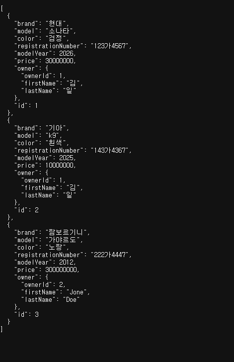
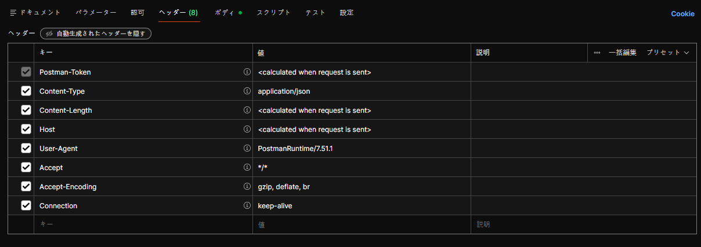

# JPA를 이용한 DB생성 및 접근
## JPA
1. 정의
JPA(Jakarta Persistence API)의 축약어로 엔티티 클래스르 통해 DB를 정의하는 방법.

즉, HeidiSQL를 통해서 DB생성하고 TABLE 생성, COLUMN정의, 그리고 SQL을 이용하여 row을 추가/수정/삭제/조회를 했던것과 달리 SpringBoot 프로젝트 내에서 해결을 한다는 점이다.

## ORM
  - Object Relational Mapping : 객체 지향 프로그래밍 패러다임을 이용하여 DB를 가져오고 매핑할 수 있는 기술(특정 Java코드가 SQL문에 대응 된다는 의미.) DB구조 보다는 객체 지향 개념을 바탕에 두고있어 Java 프로그래머 들에게 유용하고 별개의 SQL문을 숙달할 필요가 없기 때문에 개발속도 및 소스코드의 양을 줄여준다. 그리고 대부분의 DB에 독립적이기 꺠문에 DBMS에 따라 조금씩 달라지는 SQL문의 dialect에 대해 걱정할 필요가 없다.

## JPA(ORM 비교 상에서의)
  - 이전에는 Java Persistence API라고 불렸고, Java 개발자를 위한 ORM을 제공한다. 여기서 JPA Entity는 데이터 베이스 테이블의 구조를 나타내는 Java클래스를 의미한다. 즉 클래스는 테이블 명, field명은 column명으로 대응되고, 거기서 생성되는 각 객체의 field값들의 조합이row로 이루어진다고 볼수 있다.

## 하이버네이트(Hibernate)
  - 최근에 가장 인기있는 구현체면서, SpringBoot 상에서의 기본 구현체로 사용된다. 기업수준의 애플리케이션에서 자주 사용된다.

## Entity 클래스 만들기
  - JPA에서 `@Entity` 에너테이션을 이용하는 Java클래스, 엔티티 클래스는 표준 자바 빈의 명명 규칙을 따르며, 적절한 Getter / Setter를 가진다.

  - JPA는 애플리케이션이 초기화 도힐때 _클래스 이름으로 데이터 베이스 테이블을 생성_ 한다. 그래서 데이터베이스 테이블에 다른이름을 명명하고 싶다면 엔티티 클래스에 `@Table(name = " ")`을 지정 해줘야 한다.
    - 여기서 중요한 점이 User 엔티티 클래스 만들었을때 얘가 테이블 명이 되면 예약어라서 오류가 가는 경우가 많아 `@Table(name = "users")`로 지정해주는 경우까지가 기본 템플릿이다.

```java
package com.korit12.cardatabase.domain;


import jakarta.persistence.Entity;
import jakarta.persistence.GeneratedValue;
import jakarta.persistence.GenerationType;
import jakarta.persistence.Id;

@Entity
public class Car {
    @Id
    @GeneratedValue(strategy = GenerationType.AUTO)
    private Long Id;

    private String brand, model, color, registrationNumber;

    private int modelYear, Price;
}

```

- 엔티티 클래스는 데이터베이스에서 기본키로 이동되는 고유한 ID를 포함해야된다. 그런데 Field상에서 뭐가 기본키인지 DB는 모르기때문에 이를 명시하기 위해서 `@Id`를 이용해서 정의 한다. `@GeneratedValue` 에너테이션은 데이터베이스가 자동으로 ID를 생성하도록 지정(즉, AUTO_INCREMENT를 의미) 다른키 생성 전략을 지정하는것도 가능하다. AUTO유형의 경우는 JPA가 특정 데이터베이스에 적합한 전략을 택한다는 의미이며, default생성 유형에 해당한다. 또한 `@Id` 에너테이션을 여러 속성에 추가하여 복합 기본키를 만드는 것도 가능하다.

- 데이터베이스의 컬럼명은 기본적으로 클래스필드 명명 구칙에 따라 지정된다. 다른 명명규칙을 사용하고 싶다묜 `@Column` 에너테이션을 적용하면 된다. 그리고 컬럼의 길이 및 컬럼의 nullable 여부를 지정하는 것도 가능하다. 예를 들어

```java
@Column(name = "exlanation", nullable=false, length=512)
private String description;
```

- 그리고 우리는 Lombok을 쓰기 때문에 AllArgsConstructor를 쓰면 좋을꺼 같지만 id field가 자동생성이기 때문에 오히려 AllArgs를 적용하면 오류가 난다.


Lombok을 안쓴 버전.
```java
package com.korit12.cardatabase.domain;


import jakarta.persistence.Entity;
import jakarta.persistence.GeneratedValue;
import jakarta.persistence.GenerationType;
import jakarta.persistence.Id;

@Entity
public class Car {
    @Id
    @GeneratedValue(strategy = GenerationType.AUTO)
    private Long Id;

    private String brand, model, color, registrationNumber;

    private int modelYear, price;
    
    
    // 기본 생성자 : JPA에선 기본생성자가 필수
    public Car() {}

    public Car(String brand, String model, String color, String registrationNumber, int modelYear, int price) {
        this.brand = brand;
        this.model = model;
        this.color = color;
        this.registrationNumber = registrationNumber;
        this.modelYear = modelYear;
        this.price = price;
    }

    public String getBrand() {
        return brand;
    }

    public void setBrand(String brand) {
        this.brand = brand;
    }

    public String getModel() {
        return model;
    }

    public void setModel(String model) {
        this.model = model;
    }

    public String getColor() {
        return color;
    }

    public void setColor(String color) {
        this.color = color;
    }

    public String getRegistrationNumber() {
        return registrationNumber;
    }

    public void setRegistrationNumber(String registrationNumber) {
        this.registrationNumber = registrationNumber;
    }

    public int getModelYear() {
        return modelYear;
    }

    public void setModelYear(int modelYear) {
        this.modelYear = modelYear;
    }

    public int getPrice() {
        return price;
    }

    public void setPrice(int price) {
        this.price = price;
    }

    public Long getId() {
        return Id;
    }
}

```

## CRUD repository만들기
- Spring Data JPA에는 CURD작업을 위한 `CrudRepository`가 존재한다. 이를 통해 CarRepository를 만들고 extends받았는데.

- 그렇다면 CarRepository는 CrudRepository를 상속 받았기 때문에 거기 내부에 있는 추상 메서드들을 전부 다 사용할수 있다는 의미가 된다.

- 그런데 repository.save() 메서드를 고려했을때 내부의 argment로 Car 객체가 들어올꺼라고 예상할 수 없으니 이부분을 제어하는것이 제네릭을 이용한 `<Car, Long>`부분 이다

```java
package com.korit12.cardatabase.domain;

import org.springframework.data.repository.CrudRepository;

public interface CarRepository extends CrudRepository<Car, Long> {
}

```
이는 CarRepository가 테이블 역할을 하는 엔티티 클래스인 Car의 리포지토리 역할을 하는 인터페이스 이며, id의 지료형이 long임을 명시한다.

- CURD관련 메서드(즉, HeidiSQL 상에서는 뭐리문 작성 영역)들을 모아둔곳.

### 대표적인 CRUD관련 메서드
1. `long count()` - 엔티티의 수를 반환
2. `Iterable<T>` findAll() - 지정한 타입의 모든 항목을 반환 _SELECT * 처럼 보임_
3. `Optional<T>` findById(ID id) - 지정한 ID의 한 항목을 반환
4. `void delete(T Entity)` - 특정 엔티티 삭제 
5. `void deleteAll()` - 리포지토리 내의 모든 엔티티 삭제
6. `<S extends T> save (S entity)` - 엔티티를 저장 
7. `List<s> saveAll(Iterable<s> entities)` - 여러엔티티들을 한번에 저장

- 이상의 메서드 중 하나의 항목만들 return할때는 T 대신에 `Optional<T>`를 반환한다. Optional 클래스는 Java 8 SE에 도입된 자료형으로 값을 포함하거나 포함하지않는 단일 값 컨테이너 이다. 값이 존재하면 isPresnet()메서드가 true를 return 없으면 false를 return한다. 그런데 어쨋든 자료형이 Optional이기 때문에 if isPresent() (참조자료형캐스팅(from optional to Car)) 과정이 요구되;ㄴ다. 그러면 get()메서드를 통해서 존재하는 Car 클래스의 객체를 추출할 수 있다 이는 NullPointerExcperion을 방지하기 위한 방법이다.

### 더미데이터 추가 과정
- H2 인메모리에 더미데이터를 추가했는데 실행될때마다 초기화되는 특성상 매번 H2 인메모리 DB에 INSERT하는 것은 번거롭기 때문에 main단계에 데미데이터들을 일괄추가헀다. 그러면 실행 할때마다 데이터 3개는 들어있게 된다.(추후 예제코드 삽입)

- 이상을 위해 CommandLineRunner 인터페이스를 구현했다. 인터페이스 구현하니 빨간줄이 떳는데 이는 추상메서드를 구현하라는 에러

- 그래서 Carrepository내에 더미데이터들을 집어넣도록 하기 위해서 field선언을 통해 CarRepository repository를 집어 넣었고 얘가 포함된 생성자도 만들어 줬다. 그래야 main단계에서 CarRepository의 메서드인 .save()를 사용할수 있기 때문이다.

```java
public static void main(String[] args) {
		SpringApplication.run(CardatabaseApplication.class, args);
		logger.info("애플리케이션이 실행됩니다.");
	}

	// field 선언
	private final CarRepository repository;


	@Override
	public void run(String... args) throws Exception {
		repository.save(new Car("현대","소나타", "검정", "123가4567",2026, 30000000));
		repository.save(new Car("기아","k9", "흰색", "143가4367",2025, 10000000));
		repository.save(new Car("람보르기니","가야르도", "노랑", "222가4447",2012, 300000000));
	}
```

### Crud Repository 응용과정
```java
package com.korit12.cardatabase.domain;

import org.springframework.data.jpa.repository.JpaRepository;
import org.springframework.data.jpa.repository.Query;
import org.springframework.data.repository.CrudRepository;
import org.springframework.data.repository.PagingAndSortingRepository;

import java.util.List;

public interface CarRepository extends JpaRepository<Car, Long> {

    // CrudRepository에 있는 메서드라면 여기에 정리를 해줘야 함.

    List<Car> findByBrand(String brand);

    // 색상으로 검색, 그리고 연도로 검색하는 메서드를 직접 정의
    List<Car> findByColor(String color);
    List<Car> findByModelYear(int modelYear);

    // SQL 상에서의 AND 및 OR 연산자도 적용이됨.
    // 브랜드의 모델로 자동차 검색
    List<Car> findByBrandAndModel(String brand, String model);

    // 브랜드 또는 색상별로 자동차 가져오기
    List<Car> findByBrandOrColor(String brand, String color);

    List<Car> findByBrandOrderByModelYearAsc(String brand);

    // @Query 에너테이션을 사용

    @Query("Select c from Car c where c.model = ?1")
    List<Car> findByModel(String model);
    // 그런데 이상의 경우에는 일치하는 것만 구할수가있는데, @query를 쓰는 이유는 LIKE 연산자를 쓸수 있기 때문

    @Query("Select c from Car c where c.brand like %?1")
    List<Car> findByBrandEndWith(String brand);

    // 다만 @Query를 쓰게 되면 다른 데이터베이스로의 이식성이 좀 떨어짐.
}

```

CrudRepository부터 확장된 PagingAndSortingRepository도 있다. 얘는 페이징 및 정렬을 통해 앤티티클래스의 인스턴스를 검색하는 메서드를 추가 제공한다. 이는 대규모 결과 집합에서 모든 데이터를 return할 필요가 없기 때문에 데규모 데이터 처리에 적합한 형태다. CrudRepository에서 추가된 메서드가 두개 더 있는데,

1. `Iterable<T> findAll(Sort sort)` - 지정된 옵션으로 정렬된 모든 엔티티를 반환
2. `Page<T> findAll(Pageable pageable)` - 지정된 페이징 옵션으로 모든 엔티티를 반환

- 근데 우리는 종합패키지에 해당하는 `JpaRepository`를 extends 받는다.

## 테이블 간의 관계 추가 - JOIN 관련

- 과제 : Owner entity 클래스를 정의하시오.
- field 
  - ownerId : PK 역할
  - firstName / lastName

- 생성자 / Getter / Setter를 롬복을 사용하여 정의하시오.
- OwnerRepository를 생성하고 JpaRepository를 상속하시오.
- 그리고 실행해서 Owner 테이블이 존재하는지 확인하시오.

- Car 및 Owner 테이블에 일대다 관계(1:N)를 설정할겁니다. 여기서의 일대다 관계란 한 명이 자동차 여러 대를 가질 수 있지만, 한 자동차의 소유자는 한 명이라는 의미가 됩니다.

- 일대다 관계를 추가하려면 `@ManyToOne` / `@OneToMany` 애너테이션을 이용해야 합니다. 외래 키를 포함한 Car 엔티티 클래스에서는 `@ManuToOne` 애너테이션 적용, 그리고 소유자 field에 대한 Getter / Setter도 추가해야 합니다(여기서 중요한 점은 ownerId를 추가하는 것이 아니라 Owner를 추가한다는 점입니다). 모든 연관 관계에 저희는 FetchType.LAZY를 이용할 예정입니다. 대다(toMany) 관계에서는 FetchType.LAZY가 default이지만 대일(toOne) 관계에서는 정의를 추가적으로 해줘야만 합니다.

fetch type이란 데이터베이스에서 데이터를 검색하는 전략을 의미하는데, 지정 가능한 값은 즉시 검색을 요청하는 EAGER가 있고, 지연 검색을 허용하는 LAZY가 존재합니다. 예제에서 쓸 LAZY의 의미는 소유자를 검색했을 경우(즉, OwnerRepository에 있는 메서드를 호출했을 경우) 해당 소유자와 관련된 모든 자동차를 검색한다는 뜻이됩니다. 반면 즉시 검색(EAGER)는 해당 소유자의 모든 자동차를 즉시 검색합니다.

```java
// Car.java
package com.korit12.cardatabase.domain;

import jakarta.persistence.*;
import lombok.Data;
import lombok.NoArgsConstructor;
import lombok.NonNull;
import lombok.RequiredArgsConstructor;

@Entity
@Data
@NoArgsConstructor
@RequiredArgsConstructor
public class Car {
    @Id
    @GeneratedValue(strategy = GenerationType.AUTO)
    private Long id;

    @NonNull
    private String brand;
    @NonNull
    private String model;
    @NonNull
    private String color;
    @NonNull
    private String registrationNumber;
    @NonNull
    private int modelYear;
    @NonNull
    private int price;

    @ManyToOne
    @JoinColumn(name = "owner")
    private Owner owner;            // @NonNull이 없으니까 얘는 옵셔널이라고 봐야겠네요.
}

// Owner.java
package com.korit12.cardatabase.domain;

import jakarta.persistence.*;
import lombok.*;

import java.util.List;

@Entity
@NoArgsConstructor
@RequiredArgsConstructor
public class Owner {
    @Id
    @GeneratedValue(strategy = GenerationType.AUTO)
    @Getter
    private Long ownerId;

    @Getter @Setter @NonNull
    private String firstName;
    @Getter @Setter @NonNull
    private String lastName;

    @OneToMany(cascade = CascadeType.ALL, mappedBy = "owner")
    @Getter @Setter
    private List<Car> cars;
}
```

- 이상의 코드가 Entity 클래스들 간의 JOIN 관계를 Java로 표현한 예시가 됩니다. Owner는 자동차를 여러 대 가질 수 있으므로 `List<Car> cars` field를 가졌습니다.
- `@OneToMany` 애너테이션은 두 가지 특성이 있는데,
  1.  cascade 속성은 삭제 및 업데이트 시 연속 효과가 적용되는 방법을 지정합니다. 우리가 HeidiSQL에서 외래키 설정했을 때 restricted 걸어둔 부분 등을 의미합니다. 그런데 우리는 cascade를 ALL로 잡아놨기 때문에 예를 들어 소유자 한 명을 삭제했을 경우 자동차들도 같이 삭제되어버립니다(restricted의 경우 부모 row를 삭제하는게 불가능했어서 자식 row를 먼저 날리고 지워야 했습니다).



그래서 JOIN 관계를 봤을 때, 이상의 이미지에서 owner라고 하는 column이 존재하는데 내부에 1, 2, 2로 입력된 것을 확인할 수 있습니다. 즉, 실제 JOIN을 수행했다기 보다는 PK-FK 관계를 설정하는 방법에 가깝다고 볼 수 있겠습니다. JOIN해서 실제로 보고 싶다면 h2database에서 적용해볼 수 있겠네요.

그래서 실제 JOIN 수행 결과는

과 같습니다.

```sql
select * from CAR c INNER JOIN OWNER o ON c.OWNER = o.OWNER_ID;
```

이상의 수업 상황에서 주의할 점은 결국 Lombok 적용을 했을 때와 안했을 때의 코드라인이 완전히 달라진다는겁니다.

그러면 제가 push하는 부분은 Lombok 적용 버전이겠네요.

월요일에 롬복 적용 안한 버전으로 start.spring.io부터 시작해서 처음부터 만들겠습니다.

## MariaDB 데이터베이스 설정
- 이제 소프트마이그레이션을 적용하겠습니다. h2 인메모리 데이터베이스는 테스트와 시연 목적으로는 좋지만 방금 같은 상황에서 문제가 생깁니다. 성능 / 안정성 / 확장성이 필요한 애플리케이션을 고려하여 MariaDB로 이사가겠습니다.

1. HeidiSQL을 켭니다. -> cardb 데이터베이스 생성
2. build.gradle에 수정을 합니다 -> 거기에 h2 의존성 추가했었으니까요. -> 얘를 수정한다면 application.properties도 수정하겠네요.
```java
runtimeOnly 'org.mariadb.jdbc:mariadb-java-client'
```
3. 아까 위에 말한 것처럼 application.properties를 수정합니다.

```properties

```
