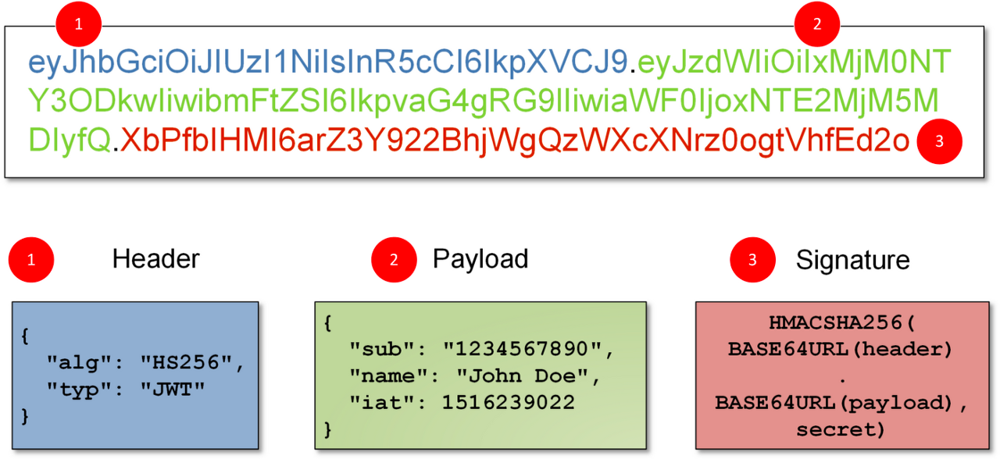
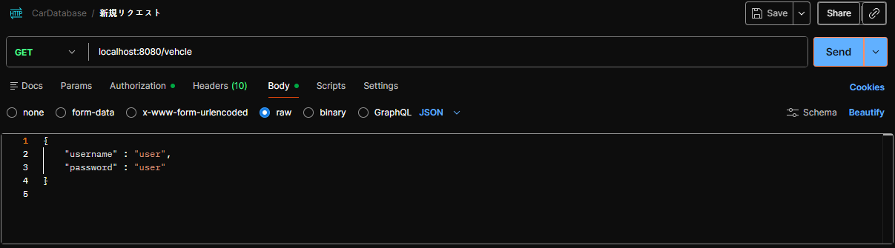

# JWT로 백엔드 보호하기
- 어제까지의 수업에서 RESTful 웹 서비스에서의 기본인증(postman 상에서 basic auth)을 이용하는 방법을 학습했다. 기본 인증이란토큰을 처리하거나 세션을 관리하는 방법이 포함되지않는다. 해당 방식은 사용자가 로그인 할 때 각 요청과 함께 자격 증명이 함께 전송 되므로 보안상의 문제가 있을수 있다. 그리고 해당 방식은 리엑트로 자체 프론트엔드를 개발할때 이용하는 것이 불가능하다. 대신 JWT를 이용한 인증 방법을 사용할 예정.

## JWT란?

- 인증 구현 방법중 하나, 인증 및 권한 부여 (Authentication & Authorization) 목적으로 RESTful API에서 가장 보편 적으로 사용된다.
- 인증 : 보통 로그인 과정과 관련
- 인가 / 권한 부여 : 특정 역할이 특정 페이지의 입장의 유무에 여부
  - 즉 인증은 받았기 때문에 로그인이 가능하긴 하지만 회원이 다른 회원을 삭제할 권한은 없는 반면에, 관리자는 다른 회원을 조회하거나 삭제하는 권한을 가질수도 있다. 즉, 인증 이후의 특정 HTTP요청에 관한 권한에 가깝다.
- JWT 자체는 크기가 매우 작기 때문에 URL/POST 매개변수 또는 해더 내부에 담아서 전송하는 것이 가능하다. 본시 수업 중에는 postman 상에서의 요청을 할때 예시를 제공 예정.
- JWT 내부에는 사용자 이름과 역할 등 필수적인 정보를 담는 것이 가능

### JWT의 구조


- header : 토큰의 유형과 해상 알고리즘을 정의
- payload : 인증에서 일반적으로 사용자 정보를 포함
- signiture : 토큰이 도중에 변경되지 않았는지 확인하는데 이용


- 이상의 이미지에서 `.` 을 기준으로 header / payload / signiture 가 분리된다.
- JWT는 인증에 성공한 후 클라이언트가 전송하는 요청에는 항상 인증 시 받은 JWT가 반드시 포함되어야 한다.

### JWT 생성 및 해석과 응용 과정

1. build.gradle에 의존성 추가
```java
// jjwt 의존성 추가
	implementation 'io.jsonwebtoken:jjwt-api:0.13.0'
	runtimeOnly 'io.jsonwebtoken:jjwt-impl:0.13.0'
	runtimeOnly 'io.jsonwebtoken:jjwt-jackson:0.13.0'
```

2. 서명된 JWT를 생성하고 검증하는 클래스를 만들어야 한다. service 패키지 내에 JwtService 라는 클래스 생성
```java
static final long EXPIRATIONTIME = 86400000;
    static final String PREFIX = "Bearer";
```
  - PREFIX는 토큰의 접두사를 의미하며, 일반적으로 "Bearer" 스키마가 사용된다. JWT Authorization 헤더에 담겨서 전송 되며, Bearer 스키마를 이용하는 경우 헤더의 내용은 이하와 같다.
    - `Authorization: Bearer <token>`

  3. jjwt 라이브러리 내의 secretKeyFor() 메서드를 활용하요 비밀키는 생성. 시연용으로만 사용되고 실제 운영환경에서는 애플리케이숀 구성에서 비밀 키를 읽어야 한다. 이후 getToken() 메서드가 토큰을 생성하고 return을 한다.
  getAuthUser() 메서드를 통해 응답의 Authorization 헤더에서 토큰을 가져온다. 그리고 parsar()메서드를 통해 JwtParser 인스턴스를 생성한다. SetSigningKey() 메서드를 통해 토큰 확인을 위한 비밀 키를 지정하는데 이용할 거고, parseClaimsJws() 메서드를 통해 Authorization 헤더에서 Bearer 접두사를 또 제거 한다. 마지막으로. GetSubJect() 메서드를 이용하여 사용자 이름을 가져온다. 

전체 코드는 이하와 같다
```java
package com.korit12.cardatabase.service;

import io.jsonwebtoken.Jwts;
import io.jsonwebtoken.SignatureAlgorithm;
import io.jsonwebtoken.security.Keys;
import jakarta.servlet.http.HttpServletRequest;
import org.springframework.http.HttpHeaders;
import org.springframework.stereotype.Service;

import javax.crypto.SecretKey;

import java.util.Date;

@Service
public class JwtService {

    static final long EXPIRATIONTIME = 86400000;
    static final String PREFIX = "Bearer ";

    static final SecretKey KEY = Keys.secretKeyFor(SignatureAlgorithm.HS256);

    public String getToken(String username) {
        return Jwts.builder()
                .subject(username)
                .expiration(new Date(System.currentTimeMillis() + EXPIRATIONTIME))
                .signWith(KEY)
                .compact();
    }

    // 토큰 검증 및 username 추출
    public String getAuthUser(HttpServletRequest request) {
        String token = request.getHeader(HttpHeaders.AUTHORIZATION);
        
        if (token != null && token.startsWith(PREFIX)) {
            // "Bearer " 접두사 제거하는 과정
            String authToken = token.substring(PREFIX.length()).trim();

            String user = Jwts.parser()
                    .verifyWith(KEY)
                    .build()
                    .parseSignedClaims(authToken)
                    .getPayload()
                    .getSubject();

            if (user != null) {
                return user;
            }
        }
        return null;
    }
}

```

- jwt의 버전이 12 이후로 바뀜에 따라 원래는 parserbuilder() 라고하는 메서드였다가 parse()로 변경이 되었다. 그래서 특정 버전을 이용해야 하는 경우도 있어서 지난 기수까지는 11로 다운그레이드 했었으나 이번에는 최신 위주로 가고있다.

4. 다음으로 인증을 위한 자격 증명을 저장하는 새로운 클래스를 추가한다. 여기서 또 새로운 자료형을 학습한다. Record라고 하는 자료형을 생성. Recoed는 데이터만 보관하는 클래스가 필요할때 보일러플레이트를 안써도 되는 자료형으로 Java14에서 추가 되었다.
    - domain 패키지 내에 AccountCredentials 생성
```java
package com.korit12.cardatabase.domain;

public record AccountCredentials(String username, String password) {
}
```
5. Login을 위한 Controller 클래스를 구현한다.(Web 요청의 가장 최전선에 있는 백엔드가 Controller 클래스.)
```java
package com.korit12.cardatabase.web;

import com.korit12.cardatabase.domain.AccountCredentials;
import com.korit12.cardatabase.service.JwtService;
import lombok.AllArgsConstructor;
import org.springframework.http.ResponseEntity;
import org.springframework.security.authentication.AuthenticationManager;
import org.springframework.stereotype.Controller;
import org.springframework.web.bind.annotation.PostMapping;
import org.springframework.web.bind.annotation.RequestBody;

@Controller
@AllArgsConstructor
public class LoginController {
    private JwtService jwtService;
    private AuthenticationManager authenticationManager;

    // 로그인이니까 POST 요청
    @PostMapping("/login")
    public ResponseEntity<?> getToken(@RequestBody AccountCredentials credentials) {
        // 토큰 생성하고 응답의 authorization 헤더로 전송해주는 로직.
        
    }
}
```

- 필요 학습 내용 정리
1. ResponseEntity 클래스
  - 정의
    - ResponseEntity는 Spring 에서 HTTP응답 전체를 나타내는 클래스로. Controller 클래스에서 쓰인다. 웹 애플리케이션 컨트롤러 클래스에서 ResponseEntity 클래스를 return하면, 개발자가 응답의 데이터(Body), HTTP 상태 코드(Status Code) 그리고 HTTP Headers를 명시적으로 제어하는 것이 가능하다

    - RESTful API 설계에서 서버의 상태를 클라이언트에게 정확하게 전달하는데 필수적.

  - 주요 특징 및 구성요소
    1. Body(본문)
      - 클라이언트 에게 실제로 전송되는 데이터 제네릭`<>`으로 지정됨.
      - `User`객체, `List<Product>` 등 (JSON형태로 변환되어 전송되. - postman에서 차 등록할 때 JSON으로 보냈고, Backend에서 Java 객체로 변환 된 뒤에 -> MariaDB에 저장됐다.)
    2. Status Code(상태코드)
      - 요청 처리 결과를 나타내는 3자리 숫자.
        1. HttpStatus.OK - 200
        2. HttpStatus.CREATED - 201
        3. HttpStatus.NOT_FOUND - 404
    3. Headers
      - 응답에 대한 추가적인 메타 데이터
        1. HttpHeaders.CONTENT_TYPE
        2. HttpHeaders.AUTHORIZAION
        3. HttpHeaders.LOCATION

```java
package com.korit12.cardatabase.config;

import com.korit12.cardatabase.service.UserDetailsServiceImpl;
import lombok.AllArgsConstructor;
import org.springframework.context.annotation.Bean;
import org.springframework.context.annotation.Configuration;
import org.springframework.http.HttpMethod;
import org.springframework.security.authentication.AuthenticationManager;
import org.springframework.security.config.annotation.authentication.builders.AuthenticationManagerBuilder;
import org.springframework.security.config.annotation.authentication.configuration.AuthenticationConfiguration;
import org.springframework.security.config.annotation.web.builders.HttpSecurity;
import org.springframework.security.config.annotation.web.configuration.EnableWebSecurity;
import org.springframework.security.config.http.SessionCreationPolicy;
import org.springframework.security.crypto.bcrypt.BCryptPasswordEncoder;
import org.springframework.security.crypto.password.PasswordEncoder;
import org.springframework.security.web.SecurityFilterChain;


@Configuration
@EnableWebSecurity
@AllArgsConstructor
public class SecurityConfig {
    private UserDetailsServiceImpl userDetailsService;

    public void configureGlobal(AuthenticationManagerBuilder auth) throws Exception {
        auth.userDetailsService(userDetailsService);
    }

    @Bean
    public PasswordEncoder passwordEncoder() {
        return new BCryptPasswordEncoder();

    }

    @Bean
    public AuthenticationManager authenticationManager(AuthenticationConfiguration authConfig) throws Exception {
        return authConfig.getAuthenticationManager();
    }

    @Bean
    public SecurityFilterChain filterChain(HttpSecurity http) throws Exception {
        http
                .csrf(csrf -> csrf.disable())
                .sessionManagement(sessionManagement -> sessionManagement.sessionCreationPolicy(SessionCreationPolicy.STATELESS))
                .authorizeHttpRequests(authorizeHttpRequests -> authorizeHttpRequests.requestMatchers(HttpMethod.POST,"/login")
                        .permitAll()
                        .anyRequest()
                        .authenticated());
        return http.build();
    }
}
```
- 이상에서 주목해야 할 메서드는 filterChain 메서드이다. SecurityFilterChain 빈은 어떤 경로가 보호되고, 어떤 경로가 보호 되지않은지를 정의한다. 메서드 내부를 보면 "/login" 경로의 POST요청에 대해서는 permitAll()이라는 메서드가 붙어있다.
```
authorizeHttpRequests -> authorizeHttpRequests.requestMatchers(HttpMethod.POST,"/login")
.permitAll()
.anyRequest()
.authenticated()
```
를 해석하면 /login 엔드포인트의 POST요청에 대해서는 permitAll()이기 때문에 JWT가 없어도 요청 가능하지만 나머지 (`anyrequest()`)의 경우는 인가(`authenticated()`)가 필요하다

이상의 과정이 모두 해결되면 postman을 통해서 login요청을 할수 있게 된다.


즉, 로그인 요청이 성공했기 때문에 JwtService에 있는 getToken() 메서드의 호출이 성공적으로 이루어졌다고 볼수 있다.

## 다른 요청을 보호하기

1. 루트 패키지에 AuthenticationFilter 클래스를 생성. 얘는 Spring Securiry 상에서의 OnceRequestFilter 인터페이스를 확장 구현하여 인증을 쓰는 doFilterInternal을 사용한다.
```java
package com.korit12.cardatabase;

import com.korit12.cardatabase.service.JwtService;
import jakarta.servlet.FilterChain;
import jakarta.servlet.ServletException;
import jakarta.servlet.http.HttpServletRequest;
import jakarta.servlet.http.HttpServletResponse;
import lombok.AllArgsConstructor;
import org.springframework.http.HttpHeaders;
import org.springframework.security.authentication.UsernamePasswordAuthenticationToken;
import org.springframework.security.core.Authentication;
import org.springframework.security.core.context.SecurityContextHolder;
import org.springframework.stereotype.Component;
import org.springframework.web.filter.OncePerRequestFilter;

import java.io.IOException;
import java.util.Collections;

@Component
@AllArgsConstructor
public class AuthenticationFilter extends OncePerRequestFilter {
    private JwtService jwtService;

    @Override
    protected void doFilterInternal(HttpServletRequest request, 
                                    HttpServletResponse response, 
                                    FilterChain filterChain) throws ServletException, IOException {
        // 토큰 검증 및 사용자 가져오기
        String jws = request.getHeader(HttpHeaders.AUTHORIZATION);
        if (jws != null) {
            String user = jwtService.getAuthUser(request);
            // 인증하기
            Authentication authentication = new UsernamePasswordAuthenticationToken(user, null, Collections.emptyList());
            SecurityContextHolder.getContext().setAuthentication(authentication);
        }
        filterChain.doFilter(request, response);
    }
}
```
- SecurityContextHolder는 스프링 시큐리티가 인증된 사용자의 세부 정보를 지정하는곳에 해당한다. 그리고 이 클래스에서 doFilter()라는 메서드를 정의해뒀는데, 이를 호출하는 단계를 생각하여야한다. -> 요청을 날릴때 마다 확인해야하기 때문에 SecurityConfig 클래스의 filterChain() 메서드 내에서 사용되어야 한다.

```java
package com.korit12.cardatabase.config;

import com.korit12.cardatabase.AuthenticationFilter;
import com.korit12.cardatabase.service.UserDetailsServiceImpl;
import lombok.AllArgsConstructor;
import org.springframework.context.annotation.Bean;
import org.springframework.context.annotation.Configuration;
import org.springframework.http.HttpMethod;
import org.springframework.security.authentication.AuthenticationManager;
import org.springframework.security.config.annotation.authentication.builders.AuthenticationManagerBuilder;
import org.springframework.security.config.annotation.authentication.configuration.AuthenticationConfiguration;
import org.springframework.security.config.annotation.web.builders.HttpSecurity;
import org.springframework.security.config.annotation.web.configuration.EnableWebSecurity;
import org.springframework.security.config.http.SessionCreationPolicy;
import org.springframework.security.crypto.bcrypt.BCryptPasswordEncoder;
import org.springframework.security.crypto.password.PasswordEncoder;
import org.springframework.security.web.SecurityFilterChain;
import org.springframework.security.web.authentication.UsernamePasswordAuthenticationFilter;


@Configuration
@EnableWebSecurity
@AllArgsConstructor
public class SecurityConfig {
    private UserDetailsServiceImpl userDetailsService;
    private AuthenticationFilter authenticationFilter;

    public void configureGlobal(AuthenticationManagerBuilder auth) throws Exception {
        auth.userDetailsService(userDetailsService);
    }

    @Bean
    public PasswordEncoder passwordEncoder() {
        return new BCryptPasswordEncoder();

    }

    @Bean
    public AuthenticationManager authenticationManager(AuthenticationConfiguration authConfig) throws Exception {
        return authConfig.getAuthenticationManager();
    }

    @Bean
    public SecurityFilterChain filterChain(HttpSecurity http) throws Exception {
        http
                .csrf(csrf -> csrf.disable())
                .sessionManagement(sessionManagement ->
                        sessionManagement.sessionCreationPolicy(SessionCreationPolicy.STATELESS))
                .authorizeHttpRequests(authorizeHttpRequests ->
                        authorizeHttpRequests.requestMatchers(HttpMethod.POST,"/login")
                        .permitAll()
                        .anyRequest()
                        .authenticated())
                .addFilterBefore(authenticationFilter, UsernamePasswordAuthenticationFilter.class);
        return http.build();
    }
}

```

private AuthenticationFilter authenticationFilter,

## 예외처리하기
- 현재 잘못된 암호를 이용하여 로그인을 시도했을 경우를 상정할때 403으로 나오기만한다. basic Auth 이용했을때는 401이라고 안내했었는데 차이가 있다. 이는 적절한 로그가 안내되지않기 때문에 협업시에 문제가 될수 있다. 그래서 예외가 발생하면 401이 뜨도록 커스텀한다.

1. 루트패키지에 AuthenticationEntryPoint를 _구현_ 하는 AuthEntrypoint 클래스를 생성. impl 받고 빨간줄 제거

## CORS 필터 추가하기
CORS(Cross Origin Resources Sharing)는 클라이언트와 서버가 교차출처 재요청을 허용하게 할 지 거부할지를 결정하게 하는 특정 헤더를 도입한다. Backend:8080 / front:5173 으로 기본 할당이 되는데 백-프론트가 서로 통신하는 과정 상에서 요청거부가 자주 일어난다.

CORS필터는 다른 출처에서 요청을 보내는 프론트엔드 에서 필요하다. CORS는 요청을 가로채고(intercept), 교차 출처로 식별되면(서로 연결관계가 있다면) 요청에 적절한 header를 추가해준다.

Spring Security의 CorsConfiguerationSource 인터페이스를 이용.

- 예제에서는 모든 출처의 HTTP 메서드와 헤더를 허용하게끔 작성한다. 나중에 프로젝트에 따라 커스텀이 요구될 수 있다.

특정 url에 대해서만 요청을 허용하려면 `config.setAllowedOrigins(Arrays.aslist("*"));` 부분을 수정하면 된다.
`config.setAllowedOrigins(Arrays.asList(http://localhost:5173))`

# Role-based Security

Spring Security에서는 역할을 이용하여 세분화된 역할 기반 보안을 정의하는 것이 가능하며, 사용자는 하나 혹은 여러개의 역할에 할당되어질 수 있다. 여ㅑㄱ할은 흔히 ADMIN,MANAGER,USER같은 계층 구조를 가진다. 예를 들어 키오스크를 기준으로 했을때 음료를 주문한다면 비회원은 역할이 없거나 USER에 해당 될 것이고, 가맹점주는 MANAGER이다. 그리고 가끔 수리하러 오거나 본사 사람은 ADMIN이 있다. 이때 ADMIN은 MANAGER의 권한 대부분을 가질수 있다는 점에서 계층적이라고 할수있다.

역할 기반 접근 제어를 SecurityConfig에서 정의할수 잇다. 이하의 예시에서 특정 역할이 필요한 엔트포인트를 따로 정의한다. `/admin/**` 엔드포인트에 접근하려면 ADMIN 역할을 가지고있고, `/user/**` 엔드포인트에 접근하려면 USER 역할을 필요하게끔 하는 예시이다.

```java
@Bean
    public SecurityFilterChain filterChain(HttpSecurity http) throws Exception {
        http
                .csrf(csrf -> csrf.disable())
                .cors(withDefaults())
                .sessionManagement(sessionManagement ->
                        sessionManagement.sessionCreationPolicy(SessionCreationPolicy.STATELESS))
                .authorizeHttpRequests(authorizeHttpRequests ->
                        authoraizeHttpRequests.requestMatchers("/admin/**")
                        .hasRole("ADMIN")
                        .requestMatchers("/user/**")
                        .hasRole("USER")
                        .anyRequest()
                        .authenticated())
                .addFilterBefore(authenticationFilter, UsernamePasswordAuthenticationFilter.class)
                .exceptionHandling(exceptionHandling ->
                        exceptionHandling.authenticationEntryPoint(exceptionHandler));
        return http.build();
    }
```

# TodoList 만들어보기
start.spring.io에서 com.todolist를 생성하세요.
JPA / mariadb 를 미리 도입하겠습니다. 나머지 필요한 의존성을 추가하세요.


## 데이터베이스의 테이블과 매핑될 클래스를 정의합니다.

User 엔티티: username, password, role 필드를 정의하고, Todo와 1:N 관계를 설정합니다.

Todo 엔티티: 할 일 내용(content)과 완료 여부(isCompleted)를 필드로 가지며, User와 N:1 관계를 맺습니다.

무한 참조 방지: JSON 직렬화 시 순환 참조가 발생하지 않도록 Todo 클래스의 user 필드에 @JsonIgnore를 반드시 추가하도록 지도하세요.

## 리포지토리 인터페이스 생성
Spring Data REST의 핵심 단계입니다. 인터페이스만 정의하면 CRUD API가 자동 생성됩니다.

- 이까지 작성했을 때 postman에서 테스트가 가능하겠네요.

## 보안 설정 (SecurityConfig)
JWT 인증을 사용하는 환경이므로, Spring Data REST가 생성한 엔드포인트에 대한 접근 권한을 설정해야 합니다.

SecurityConfig 클래스에서 /api/** 경로에 대해 인증된 사용자만 접근할 수 있도록 filterChain을 구성합니다.

로그인 경로(/login)는 permitAll()로 설정하여 토큰을 발급받을 수 있게 합니다.

## Postman을 이용한 API 테스트
코드가 완성되면 학생들에게 다음 순서로 기능을 확인하게 하세요.

GET /api: 서비스가 제공하는 전체 리소스 링크(HAL) 확인.

POST /login: 사용자 정보를 보내 JWT 토큰 발급.

POST /api/todos: Header에 Authorization: Bearer [Token]을 넣고 새로운 할 일 추가.

GET /api/todos/search/findByUserId?id=1: 사용자 ID로 필터링된 할 일 목록 조회.